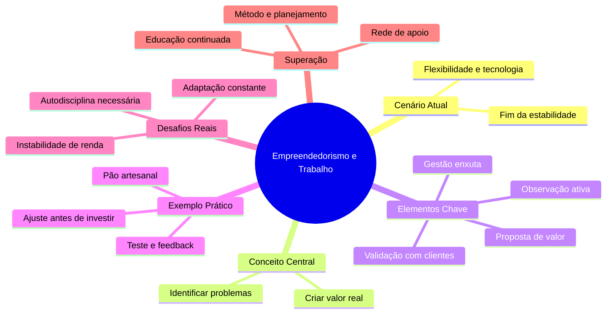

# MAPA MENTAL

```mermaid
mindmap
  root((Empreendedorismo e Trabalho))
    Cenário Atual
      Fim da estabilidade
      Flexibilidade e tecnologia
    Conceito Central
      Identificar problemas
      Criar valor real
    Elementos Chave
      Observação ativa
      Validação com clientes
      Gestão enxuta
      Proposta de valor
    Exemplo Prático
      Pão artesanal
      Teste e feedback
      Ajuste antes de investir
    Desafios Reais
      Instabilidade de renda
      Autodisciplina necessária
      Adaptação constante
    Superação
      Educação continuada
      Rede de apoio
      Método e planejamento
```
