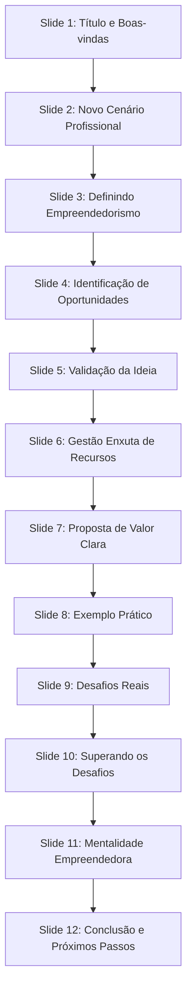

### Slides

```mermaid
flowchart TD
    A[Slide 1: Título e Boas-vindas] --> B[Slide 2: Novo Cenário Profissional]
    B --> C[Slide 3: Definindo Empreendedorismo]
    C --> D[Slide 4: Identificação de Oportunidades]
    D --> E[Slide 5: Validação da Ideia]
    E --> F[Slide 6: Gestão Enxuta de Recursos]
    F --> G[Slide 7: Proposta de Valor Clara]
    G --> H[Slide 8: Exemplo Prático]
    H --> I[Slide 9: Desafios Reais]
    I --> J[Slide 10: Superando os Desafios]
    J --> K[Slide 11: Mentalidade Empreendedora]
    K --> L[Slide 12: Conclusão e Próximos Passos]
```
