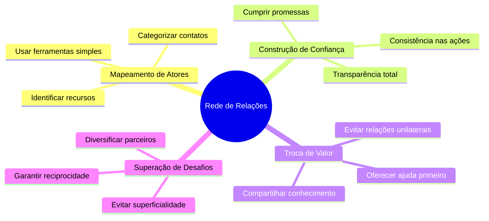

# MAPA MENTAL

```mermaid
mindmap
  root((Rede de Relações))
    Mapeamento de Atores
      Identificar recursos
      Categorizar contatos
      Usar ferramentas simples
    Construção de Confiança
      Consistência nas ações
      Transparência total
      Cumprir promessas
    Troca de Valor
      Evitar relações unilaterais
      Oferecer ajuda primeiro
      Compartilhar conhecimento
    Superação de Desafios
      Evitar superficialidade
      Garantir reciprocidade
      Diversificar parceiros
```
