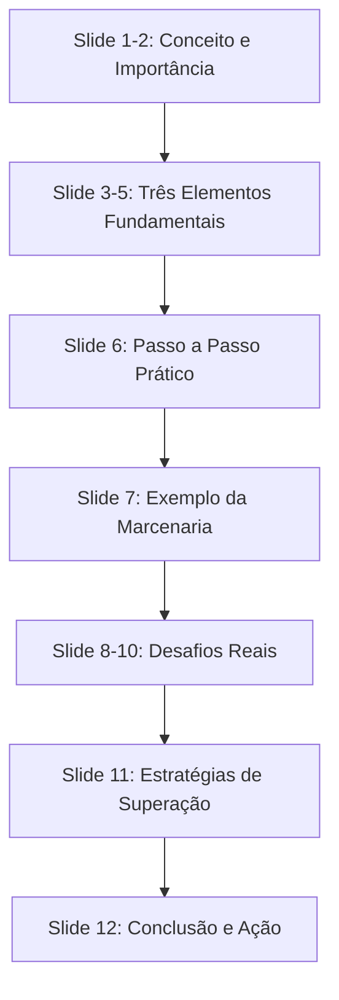

### Slides

```mermaid
flowchart TD
    A[Slide 1-2: Conceito e Importância] --> B[Slide 3-5: Três Elementos Fundamentais]
    B --> C[Slide 6: Passo a Passo Prático]
    C --> D[Slide 7: Exemplo da Marcenaria]
    D --> E[Slide 8-10: Desafios Reais]
    E --> F[Slide 11: Estratégias de Superação]
    F --> G[Slide 12: Conclusão e Ação]
```
