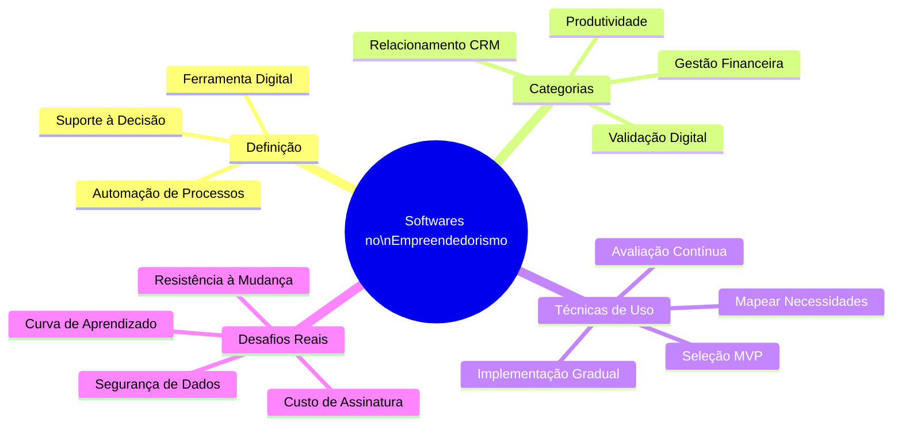

# MAPA MENTAL

```mermaid
mindmap
  root((Softwares no\nEmpreendedorismo))
    Definição
      Ferramenta Digital
      Automação de Processos
      Suporte à Decisão
    Categorias
      Produtividade
      Gestão Financeira
      Relacionamento CRM
      Validação Digital
    Técnicas de Uso
      Mapear Necessidades
      Seleção MVP
      Implementação Gradual
      Avaliação Contínua
    Desafios Reais
      Custo de Assinatura
      Curva de Aprendizado
      Resistência à Mudança
      Segurança de Dados
```
