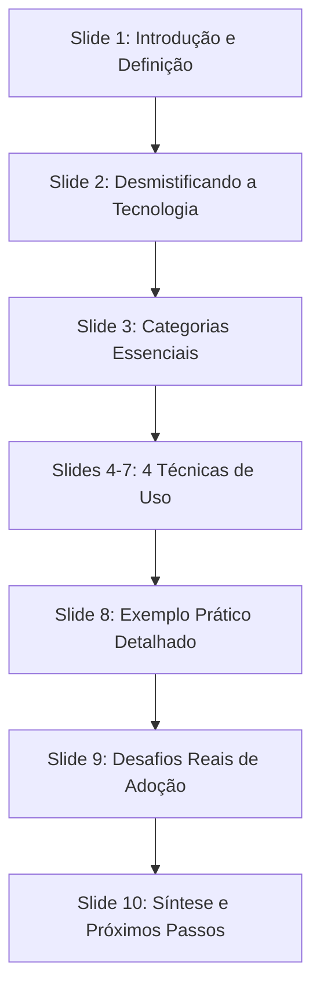

```mermaid
graph TD
    A[Slide 1: Introdução e Definição] --> B[Slide 2: Desmistificando a Tecnologia]
    B --> C[Slide 3: Categorias Essenciais]
    C --> D[Slides 4-7: 4 Técnicas de Uso]
    D --> E[Slide 8: Exemplo Prático Detalhado]
    E --> F[Slide 9: Desafios Reais de Adoção]
    F --> G[Slide 10: Síntese e Próximos Passos]
```
