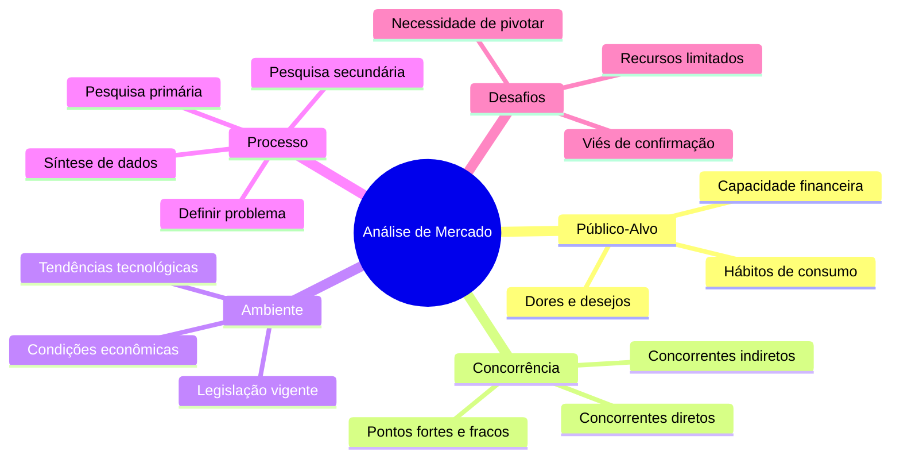

# MAPA MENTAL

```mermaid
mindmap
  root((Análise de Mercado))
    Público-Alvo
      Dores e desejos
      Capacidade financeira
      Hábitos de consumo
    Concorrência
      Concorrentes diretos
      Concorrentes indiretos
      Pontos fortes e fracos
    Ambiente
      Legislação vigente
      Tendências tecnológicas
      Condições econômicas
    Processo
      Definir problema
      Pesquisa secundária
      Pesquisa primária
      Síntese de dados
    Desafios
      Viés de confirmação
      Recursos limitados
      Necessidade de pivotar
```
