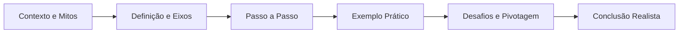

# Slides

```mermaid
flowchart LR
    A[Contexto e Mitos] --> B[Definição e Eixos]
    B --> C[Passo a Passo]
    C --> D[Exemplo Prático]
    D --> E[Desafios e Pivotagem]
    E --> F[Conclusão Realista]
```
