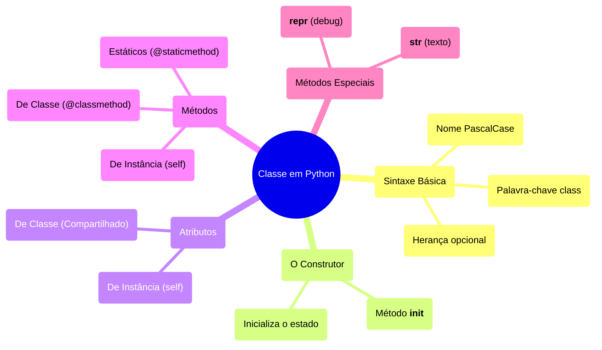

# Extrutura básica de uma CLASSE

### 🎨 Legenda de Classificação (Cores do Mapa)

* 🔵 **Azul**: Tema Central (O assunto principal da aula)
* 🟡 **Amarelo**: Básico (Estrutura essencial, sem a qual o código não roda)
* 🟢 **Verde**: Importante (Conceitos chave usados no dia a dia da POO)
* 🟣 **Roxo**: Opcional (Tópicos avançados ou de herança)
* 🩷 **Rosa**: Opcional (Detalhes, métodos estáticos ou especiais)

