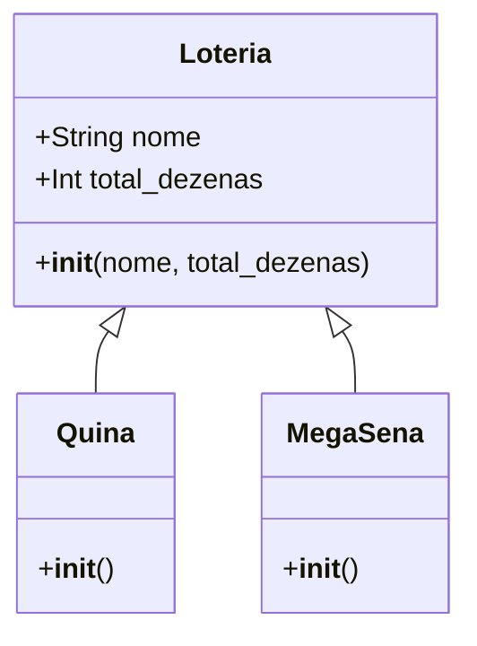

# 1. Diagrama de Classes

```mermaid
classDiagram
  class Loteria {
    +String nome
    +Int total_dezenas
    +__init__(nome, total_dezenas)
  }
  class Quina {
    +__init__()
  }
  class MegaSena {
    +__init__()
  }
  Loteria <|-- Quina
  Loteria <|-- MegaSena
```
