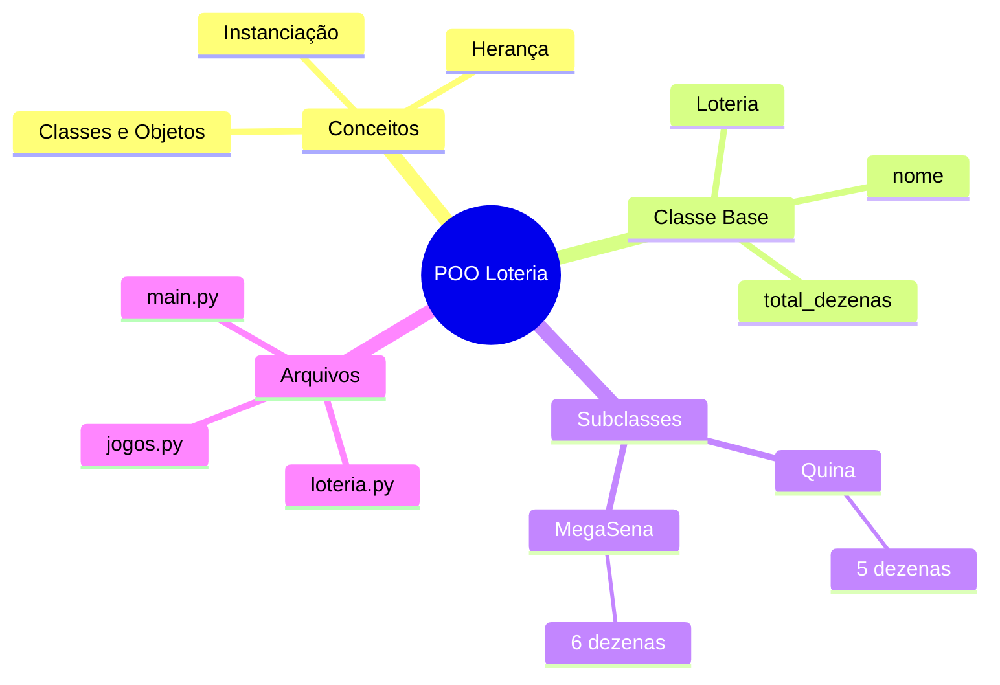

# MAPA MENTAL

```mermaid
mindmap
  root((POO Loteria))
    Conceitos
      Herança
      Instanciação
      Classes e Objetos
    Classe Base
      Loteria
      nome
      total_dezenas
    Subclasses
      Quina
        5 dezenas
      MegaSena
        6 dezenas
    Arquivos
      loteria.py
      jogos.py
      main.py
```
