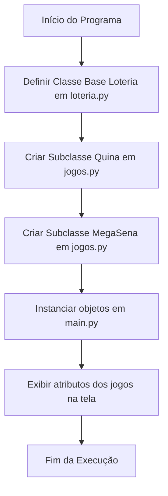

# SLIDES

```mermaid
flowchart TD
  A[Início do Programa] --> B[Definir Classe Base Loteria em loteria.py]
  B --> C[Criar Subclasse Quina em jogos.py]
  C --> D[Criar Subclasse MegaSena em jogos.py]
  D --> E[Instanciar objetos em main.py]
  E --> F[Exibir atributos dos jogos na tela]
  F --> G[Fim da Execução]
```
