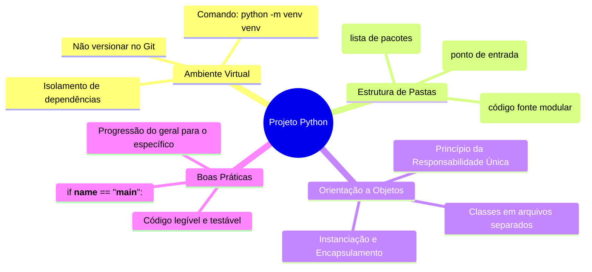

## MAPA MENTAL

```mermaid
mindmap
  root((Projeto Python))
    Ambiente Virtual
      Isolamento de dependências
      Comando: python -m venv venv
      Não versionar no Git
    Estrutura de Pastas
      src/ (código fonte modular)
      main.py (ponto de entrada)
      requirements.txt (lista de pacotes)
    Orientação a Objetos
      Classes em arquivos separados
      Princípio da Responsabilidade Única
      Instanciação e Encapsulamento
    Boas Práticas
      if __name__ == "__main__":
      Código legível e testável
      Progressão do geral para o específico
```
