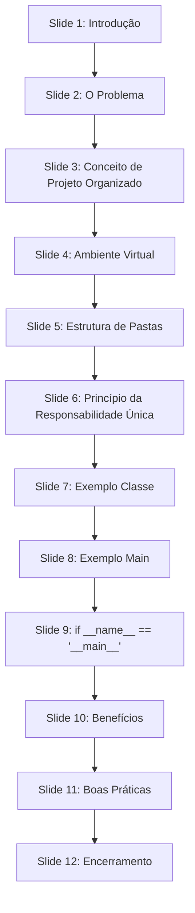

### Slides

```mermaid
flowchart TD
    A[Slide 1: Introdução] --> B[Slide 2: O Problema]
    B --> C[Slide 3: Conceito de Projeto Organizado]
    C --> D[Slide 4: Ambiente Virtual]
    D --> E[Slide 5: Estrutura de Pastas]
    E --> F[Slide 6: Princípio da Responsabilidade Única]
    F --> G[Slide 7: Exemplo Classe]
    G --> H[Slide 8: Exemplo Main]
    H --> I[Slide 9: if __name__ == '__main__']
    I --> J[Slide 10: Benefícios]
    J --> K[Slide 11: Boas Práticas]
    K --> L[Slide 12: Encerramento]
```
