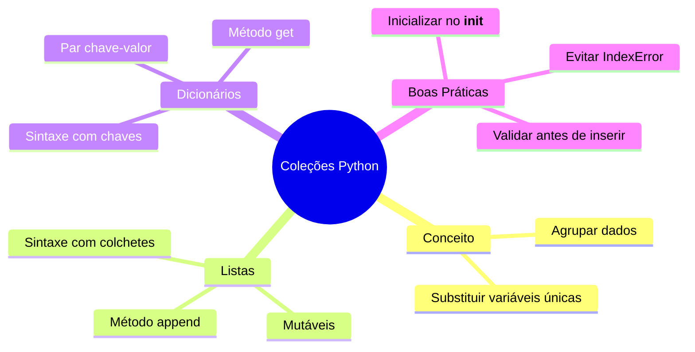

# MAPA MENTAL

```mermaid
mindmap
  root((Coleções Python))
    Conceito
      Agrupar dados
      Substituir variáveis únicas
    Listas
      Sintaxe com colchetes
      Mutáveis
      Método append
    Dicionários
      Sintaxe com chaves
      Par chave-valor
      Método get
    Boas Práticas
      Inicializar no __init__
      Validar antes de inserir
      Evitar IndexError
```
