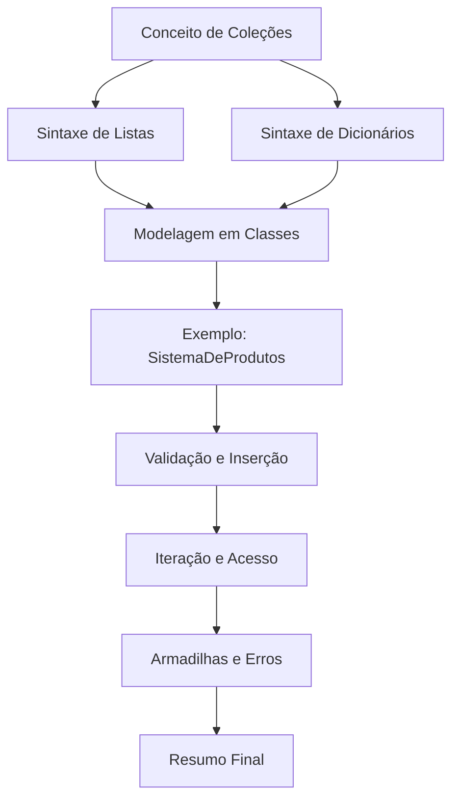

# SLIDES

```mermaid
flowchart TD
    A[Conceito de Coleções] --> B[Sintaxe de Listas]
    A --> C[Sintaxe de Dicionários]
    B --> D[Modelagem em Classes]
    C --> D
    D --> E[Exemplo: SistemaDeProdutos]
    E --> F[Validação e Inserção]
    F --> G[Iteração e Acesso]
    G --> H[Armadilhas e Erros]
    H --> I[Resumo Final]
```
