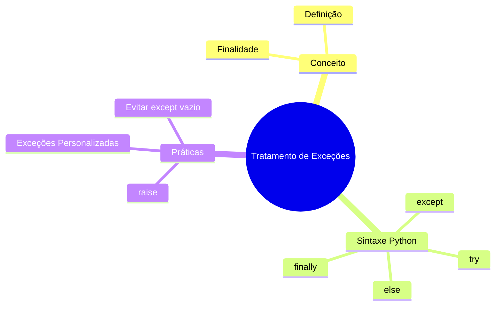

# MAPA MENTAL

```mermaid
mindmap
  root((Tratamento de Exceções))
    Conceito
      Definição
      Finalidade
    Sintaxe Python
      try
      except
      else
      finally
    Práticas
      raise
      Exceções Personalizadas
      Evitar except vazio
```
