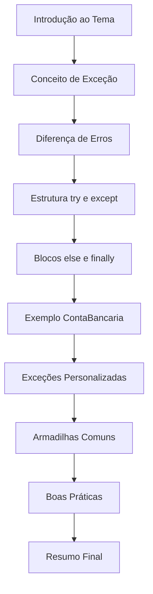

# SLIDES

```mermaid
flowchart TD
  A[Introdução ao Tema] --> B[Conceito de Exceção]
  B --> C[Diferença de Erros]
  C --> D[Estrutura try e except]
  D --> E[Blocos else e finally]
  E --> F[Exemplo ContaBancaria]
  F --> G[Exceções Personalizadas]
  G --> H[Armadilhas Comuns]
  H --> I[Boas Práticas]
  I --> J[Resumo Final]
```

