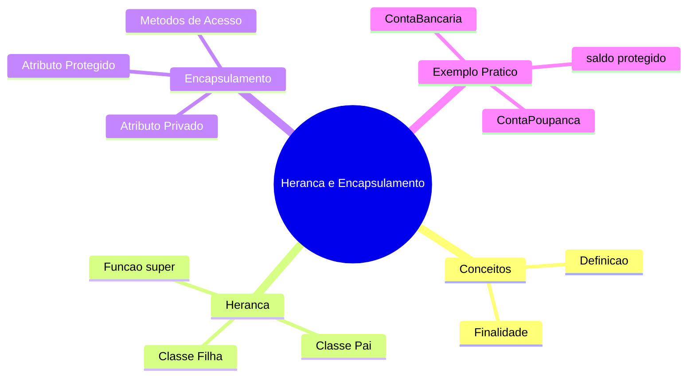

# MAPA MENTAL

```mermaid
mindmap
  raiz((Heranca e Encapsulamento))
    Conceitos
      Definicao
      Finalidade
    Heranca
      Classe Pai
      Classe Filha
      Funcao super
    Encapsulamento
      Atributo Protegido
      Atributo Privado
      Metodos de Acesso
    Exemplo Pratico
      ContaBancaria
      ContaPoupanca
      saldo protegido
```
