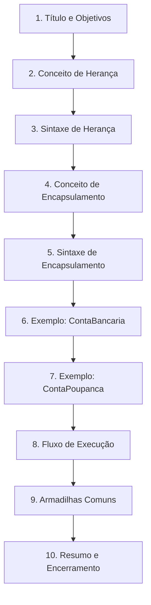

# SLIDES

```mermaid
flowchart TD
    A[1. Título e Objetivos] --> B[2. Conceito de Herança]
    B --> C[3. Sintaxe de Herança]
    C --> D[4. Conceito de Encapsulamento]
    D --> E[5. Sintaxe de Encapsulamento]
    E --> F[6. Exemplo: ContaBancaria]
    F --> G[7. Exemplo: ContaPoupanca]
    G --> H[8. Fluxo de Execução]
    H --> I[9. Armadilhas Comuns]
    I --> J[10. Resumo e Encerramento]
```
