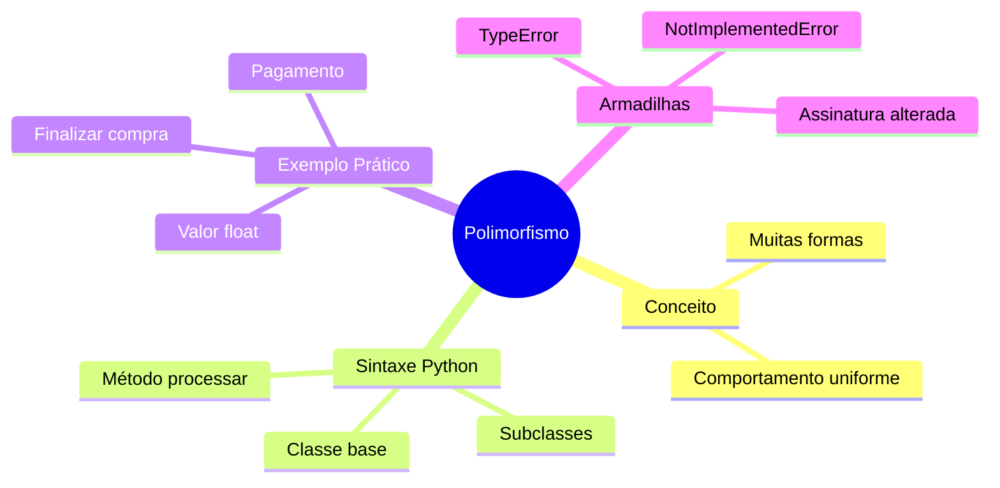

# MAPA MENTAL

```mermaid
mindmap
  root((Polimorfismo))
    Conceito
      Muitas formas
      Comportamento uniforme
    Sintaxe Python
      Classe base
      Subclasses
      Método processar
    Exemplo Prático
      Pagamento
      Valor float
      Finalizar compra
    Armadilhas
      NotImplementedError
      Assinatura alterada
      TypeError
```
