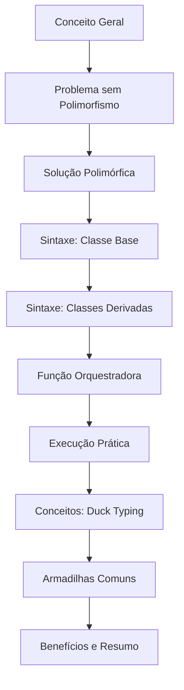

# SLIDES

```mermaid
flowchart TD
    A[Conceito Geral] --> B[Problema sem Polimorfismo]
    B --> C[Solução Polimórfica]
    C --> D[Sintaxe: Classe Base]
    D --> E[Sintaxe: Classes Derivadas]
    E --> F[Função Orquestradora]
    F --> G[Execução Prática]
    G --> H[Conceitos: Duck Typing]
    H --> I[Armadilhas Comuns]
    I --> J[Benefícios e Resumo]
```
