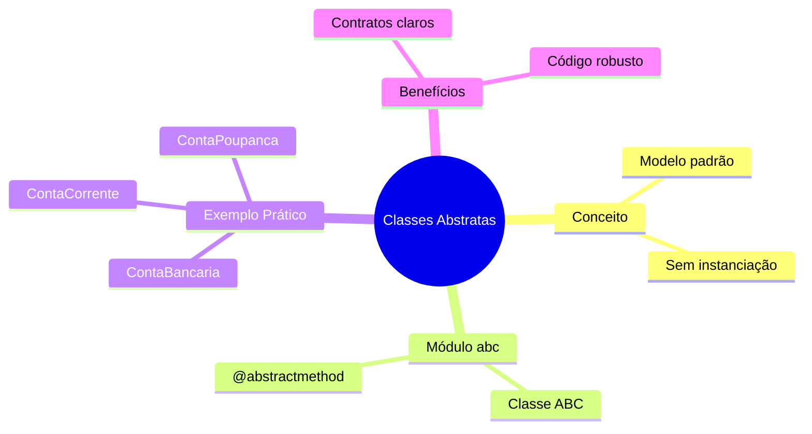

# MAPA MENTAL

```mermaid
mindmap
  root((Classes Abstratas))
    Conceito
      Modelo padrão
      Sem instanciação
    Módulo abc
      Classe ABC
      @abstractmethod
    Exemplo Prático
      ContaBancaria
      ContaCorrente
      ContaPoupanca
    Benefícios
      Contratos claros
      Código robusto
```
