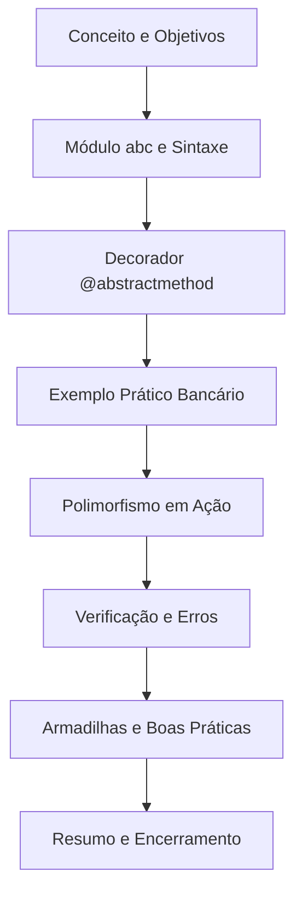

# SLIDES

```mermaid
flowchart TD
    A[Conceito e Objetivos] --> B[Módulo abc e Sintaxe]
    B --> C[Decorador @abstractmethod]
    C --> D[Exemplo Prático Bancário]
    D --> E[Polimorfismo em Ação]
    E --> F[Verificação e Erros]
    F --> G[Armadilhas e Boas Práticas]
    G --> H[Resumo e Encerramento]
```
